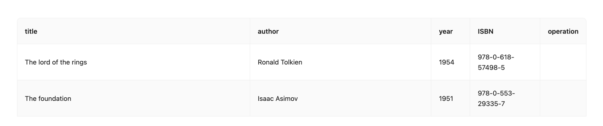
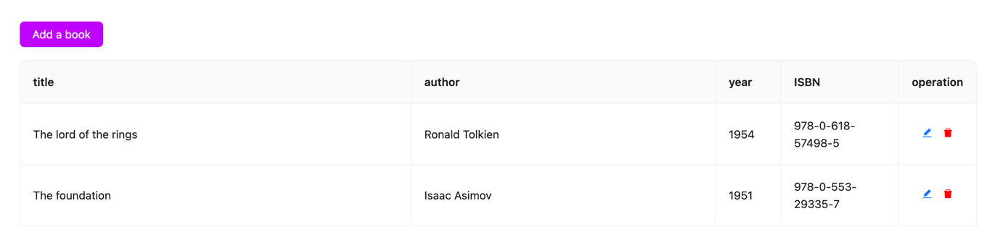

# cardo-library

## Description

This is a simple library application that allows users to create an account and add, edit or remove books to/from the 
library.

Anyone can see and list the books but only registered users can add, edit or remove books.

Unauthenticated user won't see the add, edit or delete buttons:


Once the user is successfully authenticated, the buttons will show up:



## Development

### Backend & Frontend

Install dependencies:
```bash
yarn
```

Run the app:
```bash
yarn start
```

### Docker

Run the following command to bring up the basic containers

```bash
docker-compose up -d db frontend banckend
```

## Future work

### Backend

- Add exception handling in controllers
- Add recovery password functionality
- Add logger

### Frontend

- Add error handling and notification toasts
- Add better form validation
